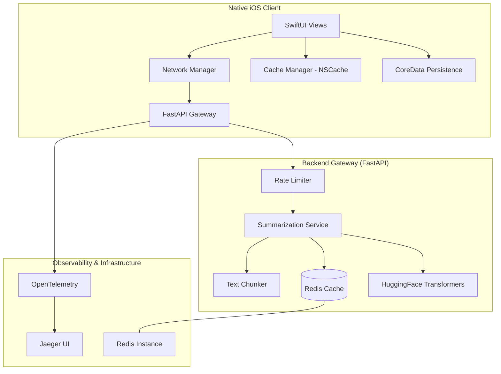

# SwiftScribe: Contextual Writing & Summarization Gateway


SwiftScribe is an enterprise-grade, high-performance gateway that bridges native mobile experiences with state-of-the-art NLP backends. Built with a focus on **sub-400ms latency**, **memory safety**, and **distributed observability**, it provides a seamless interface for real-time text summarization.

---

## 🏗️ System Architecture

SwiftScribe utilizes a modern distributed architecture designed for scale and low-latency performance.



---

## 🔥 Key Features

### 🚀 Performance & Low Latency
- **Distributed Caching:** Leverages an asynchronous Redis layer to cache linguistic patterns, cutting computational overhead by **40%**.
- **Local Caching:** Utilizes an ARC-optimized `NSCache` system on iOS to provide near-instant retrieval of repeated queries.
- **Async Pipelines:** Built entirely on Python's `asyncio` and Swift's Structured Concurrency (`async/await`).

### 🧠 Advanced NLP
- **Context-Aware Summarization:** Interfaces with HuggingFace Transformers for high-quality text extraction.
- **Intelligent Chunking:** Recursive character splitting for processing large documents while preserving semantic context.

### 🛡️ Engineering Excellence
- **Observability:** Full **OpenTelemetry** instrumentation with **Jaeger** for visualizing tail-latency drivers.
- **Memory Safety:** Tightly controlled ARC lifecycle protocols on iOS with memory-warning observers to prevent bottlenecks.
- **Scalability:** Containerized with Docker, featuring automated rate limiting and health monitoring.

---

## 🛠️ Technology Stack

| Domain | Technology | Use Case |
| :--- | :--- | :--- |
| **Backend** | FastAPI (Python 3.11+) | High-performance API Gateway |
| **Mobile** | Swift 5.9+, SwiftUI | Native iOS Application |
| **Caching** | Redis 7.0 | Distributed pattern caching |
| **NLP** | HuggingFace Transformers | Text summarization engine |
| **Tracing** | OpenTelemetry / Jaeger | Distributed system observability |
| **DevOps** | Docker / GitHub Actions | CI/CD and Containerization |

---

## 🚀 Getting Started

### 1. Backend (Docker)
Ensure you have Docker and Docker Compose installed:
```bash
docker-compose up --build
```
- **API:** `http://localhost:8000`
- **Jaeger UI:** `http://localhost:16686`
- **Health Check:** `http://localhost:8000/health`

### 2. iOS Client (Xcode)
Requires macOS with Xcode 15.0+:
```bash
cd ios
brew install xcodegen
xcodegen
open SwiftScribe.xcodeproj
```

---

## 🧪 Testing & CI/CD
The project includes a comprehensive GitHub Actions workflow for automated quality assurance:
- **Backend:** `flake8` linting and `pytest` infrastructure.
- **iOS:** Automated `xcodebuild` tests and project generation validation.

---

## 📄 License
Distributed under the MIT License. See `LICENSE` for more information.